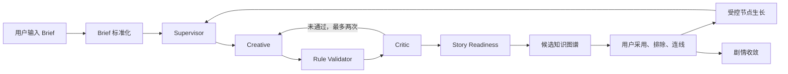

# 创意织图：创意知识图谱广告助手 Demo

这是一个用于验证“从碎片 Brief 到可追溯短视频广告创意”的全栈 Demo。

系统使用 DeepSeek 的 OpenAI-compatible API，通过四个 Agent 将用户输入转成结构化创意知识图谱；用户可以采用、排除、继续生长节点并建立语义关系，最后从已采用子图收敛为剧情草案。

> 支持 `mock` / `deepseek` 双模式。Project、Graph、Story 和暂停的 Workflow 由服务端 Repository/Checkpoint 持久化；localStorage 只保留当前项目 ID 指针。

## 在线演示

[打开私有演示站点](https://creative-graph-prd-demo.humble-ape-8092.chatgpt.site)

## 核心功能

- 结构化 Creative Brief：推广对象、已知信息、动态碎片想法、必须保留、禁止内容和高级约束。
- 首轮图谱生成：三个固定分类，每类生成两个候选节点。
- 四 Agent 协作：Supervisor、Creative、Critic、Story；Supervisor 输出 Structured Decision（intent: initial/grow/relation/converge，技术设计 4.1）。
- 候选治理：用户采用、排除或恢复节点，AI 不能直接写入正式事实。
- 节点编辑：名称、描述、子类型可直接编辑保存（FR-04）。
- 需复核传播：编辑已采用节点后，其语义关系邻居标记为「需复核」，确认前不进入最终剧情（FR-12 / PRD 5.2）。
- 两种删除：仅删当前节点（后代上移）与级联删除整棵分支（FR-09）。
- 受控创意生长：按深化、后续事件、冲突、元素、反转和平行方案继续生成。
- 主体防遗忘：生长请求携带推广主体、叙事主体、祖先路径、已采用邻域和排除记忆。
- 点击连线：连线时 Creative Agent 生成 2～4 个关系候选，支持改方向和手动输入（FR-08）。
- 剧情收敛：Story Agent 只读取已采用节点和已采用关系，生成结构化剧情，引用校验不通过会拒绝输出（FR-10 / PRD 7.3）。
- 会话恢复：图谱、关系、剧情和阶段自动保存，刷新后完整恢复（FR-11）。
- 节点拖拽与层级整理：自由拖动节点位置，一键按生成深度重新排列（FR-03 基础版）。
- 节点字段：depth（生成深度）、originalParentId/originalDepth（变更溯源）、importance（重要性 1-5，PRD 7.1）。
- mock 模式：不调用真实 API 即可离线跑通完整演示（PRD 9.1）。
- PostgreSQL：事务提交、乐观 revision、幂等 operationId、两种删除和 Story 版本。
- LangGraph：StateGraph、interrupt/resume 和 PostgreSQL durable checkpoint。
- 可观测性：按 requestId/threadId/projectId 查询 Agent/Workflow Trace。

## 技术栈

- React 19
- TypeScript
- vinext / Vite
- Cloudflare Workers-compatible API Routes
- DeepSeek `deepseek-chat`，通过 OpenAI-compatible `/chat/completions` 接口调用
- Sites 私有部署

## 系统流程



### 四个 Agent 的职责

| Agent | 职责 | 不负责 |
|---|---|---|
| Supervisor | 理解任务、判断意图、规划上下文 | 不生成创意节点 |
| Creative | 生成结构化候选或执行局部 Repair | 不写数据库 ID、状态和坐标 |
| Critic | 检查偏题、重复、主体漂移、禁用内容和广告目标遗忘 | 不替代确定性字段校验 |
| Story | 评估叙事准备度 | 候选阶段不直接生成正式故事 |

## 四条主要 API（对应 PRD 8.2）

### `POST /api/graph/diverge`（对应 PRD `POST /api/graph/start`）

根据新 Brief 生成首轮六个候选节点。

主要处理过程：

1. 标准化 Brief；
2. Supervisor 规划上下文；
3. Creative 生成三类各两个候选；
4. Rule Validator 检查数量、分类和字段；
5. Critic 语义审查，最多两次 Repair；
6. Story 返回叙事准备度。

### `POST /api/graph/grow`

从选中节点生成两个或三个受控生长候选。

请求包含：

- 当前 `graphRevision`；
- 节点和关系快照；
- 生长模式、目标分类和补充要求；
- 推广主体、叙事主体和产品卖点引用。

服务端会重新计算祖先路径、已采用邻域和排除记忆，检查循环父链、分支深度、主体引用、父节点引用和产品卖点引用。候选通过 Critic 后才返回前端，但不会自动提交为正式节点。

### `POST /api/graph/relations`

用户连接两个内容节点后，Creative Agent 基于两个端点、属性、已有关系生成 2～4 个有方向的关系候选（FR-08）。候选只是 pending 建议，用户可换一批、手动输入、改方向；确认后才成为正式语义关系。

### `POST /api/graph/concept`

剧情收敛端点（FR-10）。Story Agent 只读取已采用节点（`adoptedNodes`）和已采用关系（`adoptedEdges`），输出结构化剧情：一句话创意、核心主题、叙事视角、核心冲突、故事主线、五节拍（HOOK/发展/转折/高潮/CTA）、卖点植入、反转记忆点、CTA 和拍摄可行性建议。未采用内容不会进入生成上下文。

## 项目目录

```text
prd-architecture-demo/
├─ app/
│  ├─ api/graph/diverge/route.ts   # 首轮图谱 API（PRD /api/graph/start）
│  ├─ api/graph/grow/route.ts      # 受控生长 API
│  ├─ api/graph/relations/route.ts # 关系候选推荐 API（FR-08）
│  ├─ api/graph/concept/route.ts   # 剧情收敛 API（FR-10）
│  ├─ globals.css                  # 页面和图谱交互样式
│  ├─ layout.tsx                   # 页面元数据与根布局
│  └─ page.tsx                     # Brief、图谱、关系和输出 UI
├─ lib/agents/
│  ├─ deepseek.ts                  # 统一 LLM 入口（mock/deepseek 路由）
│  ├─ mock-llm.ts                  # mock 适配器（离线演示，PRD 9.1）
│  ├─ graph-pipeline.ts            # 首轮四 Agent + 关系推荐 + 剧情收敛
│  └─ growth-pipeline.ts           # 生长四 Agent 流程
├─ lib/workflow/                   # LangGraph StateGraph、HITL、durable checkpoint
├─ lib/repositories/               # Memory/PostgreSQL Repository
├─ lib/retrieval/                  # Mock/HTTP RetrievalProvider
├─ db/migrations/                  # 正式 PostgreSQL migrations
├─ tests/                          # Unit、HTTP、Repository、Workflow 集成测试
├─ .env.example                    # 环境变量模板
├─ package.json
└─ README.md
```

## 本地运行

### 1. 环境要求

- Node.js `>=22.13.0`
- npm
- 一个可用的 DeepSeek API Key

### 2. 安装依赖

```bash
npm install
```

### 3. 配置环境变量

复制模板：

```bash
cp .env.example .env
```

在 `.env` 中填写（二选一）：

**模式一：mock（无需 API Key，离线跑通完整演示）**

```env
CREATIVE_MODEL_PROVIDER=mock
```

**模式二：deepseek（真实调用）**

```env
OPENAI_API_KEY=你的API密钥
OPENAI_BASE_URL=https://api.deepseek.com
OPENAI_MODEL=deepseek-chat
OPENAI_TIMEOUT_MS=60000
OPENAI_MAX_TOKENS=4096
CREATIVE_MODEL_PROVIDER=deepseek
```

不要使用 `NEXT_PUBLIC_` 或 `VITE_` 前缀，否则密钥可能进入浏览器代码。`.env` 已被 Git 忽略，不要把真实密钥发给同学或提交到仓库。

### 4. 启动开发环境

```bash
npm run dev
```

根据终端输出打开本地地址。

### 5. 构建和检查

```bash
npm run build
npm test
```

`npm test` 会重新构建，并检查页面可以服务、四条 API 路由接入对应 Agent Pipeline、mock 路由和会话恢复接线。

## 推荐体验顺序

1. 在 Brief 页面至少填写推广对象和一条碎片想法。
2. 生成首轮知识图谱。
3. 采用一个人物或主体节点。
4. 采用相关冲突和事件节点。
5. 选择节点，点击“继续生长”。
6. 选择生长方向并生成候选。
7. 使用节点右侧连接点建立语义关系（Creative Agent 会给出关系候选）。
8. 试试节点编辑（✎）和两种删除（🗑）。
9. 采用至少一个节点后收敛为剧情（Story Agent 生成结构化剧情）。
10. 刷新页面验证会话恢复。

## 数据与事实边界

- AI 只生成候选内容及其解释。
- 节点 ID、状态、坐标、版本和关系保存由业务代码处理。
- 未采用候选不会进入最终剧情上下文。
- 未确认（pending）关系不进入剧情收敛，只有已采用关系参与。
- 已排除节点作为排除记忆参与后续生长。
- 生长候选必须引用真实存在的父节点、主体和产品卖点。
- 同一分支连续生长达到三层后会被阻止继续扩张。

## 当前限制

- 本地默认 `memory` 便于演示，进程重启后不会保留；正式环境强制 PostgreSQL。
- 图谱布局采用固定分类槽位，节点非常多时仍需要 React Flow + 自动布局算法。
- 没有账号级项目管理、多人协作、审计记录和限流。
- mock 模式返回固定候选，仅用于流程演示，不代表真实模型质量。

完整的数据库、工作流、测试与生产配置见 [docs/SETUP.md](docs/SETUP.md)、[docs/DATABASE.md](docs/DATABASE.md) 和 [docs/WORKFLOW.md](docs/WORKFLOW.md)。

## 交接注意事项

- 不要共享当前 `.env`，每位同学使用自己的 API Key。
- 如果密钥曾经出现在截图、聊天或 Git 历史中，应立即在 DeepSeek 控制台撤销并重新生成。
- 提交代码前先执行 `git status`，确认没有 `.env`、构建压缩包或本地日志。
- 线上 Sites 环境变量与本地 `.env` 分开管理，本地修改不会自动同步到线上。
