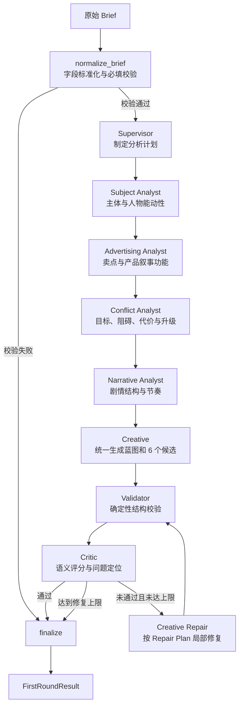

# B 部分：首轮多 Agent 创意工作流说明

> 面向前端、后端、数据库与算法队友的代码阅读文档  
> 当前版本：`shared-state-v1` / `first-round-v1`

## 1. 这部分代码解决什么问题

这部分代码负责把用户提交的广告 Brief 转换为**首轮知识图谱候选**，并在输出前完成结构校验、语义评价和有限次数的自动修复。

它的核心目标不是直接写出一篇最终广告故事，而是先形成一组可供用户选择的结构化创意资产：

- 一份 `StoryBlueprint`：所有首轮候选共同遵循的叙事假设；
- 2 个“创意元素”候选；
- 2 个“动机与冲突”候选；
- 2 个“剧情事件”候选；
- 候选之间的语义支撑关系；
- Critic 的评分、问题说明和修复方案。

用户采用候选以后，后续系统才能把被采用的节点写入正式知识图谱，并基于 adopted 子图收敛正式 Story。因此这里返回的候选不等于已入库节点，`StoryBlueprint` 也不等于最终剧本。

## 2. 总体流程



工作流由 `StateGraph` 的普通边和条件边控制。Agent 只完成自己的业务处理，不直接决定下一个 Agent，也不会互相调用。

## 3. 为什么使用统一 SharedState

所有节点只通过同一个 `SharedState` 交换数据：

```text
Brief
  -> plan
  -> analyses.subject
  -> analyses.advertising
  -> analyses.conflict
  -> analyses.narrative
  -> draft
  -> validation
  -> critique / repair_plan
  -> final_result
```

`SharedState` 中的主要字段如下：

| 字段 | 含义 | 主要写入者 |
|---|---|---|
| `task_id` | 本次任务标识 | 初始化函数 |
| `raw_brief` | 前端提交的原始 Brief | 初始化函数 / Normalizer |
| `brief` | 标准化后的 Brief | Normalizer |
| `messages` | 节点执行记录，用于调试与追踪 | 所有节点 |
| `plan` | 分析目标、上下文计划和风险 | Supervisor |
| `analyses` | 四个分析 Agent 的结构化结论 | 四个 Analyst |
| `draft` | Story Blueprint、候选和支撑关系 | Creative / Creative Repair |
| `validation` | 确定性校验结果 | Validator |
| `critique` | 语义评分与问题 | Critic |
| `repair_plan` | 保留、重写、删除和补充要求 | Critic |
| `final_result` | 对外使用的首轮结果 | Finalizer |
| `iteration` | 已完成的修复次数 | Creative Repair |
| `max_iterations` | 最大修复次数，默认 2 | 初始化函数 |
| `errors` | 流程级错误 | Normalizer 等确定性节点 |
| `metadata` | State、Prompt、Schema 版本及调用追踪 | 初始化函数 / 所有节点 |

### 3.1 不可变更新规则

每个节点必须遵守四步：

1. 读取传入的旧 State；
2. 根据旧 State 计算本节点结果；
3. 创建完整的新 State；
4. 返回完整的新 State。

项目通过两层机制执行这一规则：

- `rebuild_state()` 会重新构造全部字段，并深拷贝列表、字典等可变对象；
- `@immutable_full_state_node` 会在运行时检查旧 State 是否被修改、返回字段是否完整、顶层可变容器是否被复用。

因此节点不能写成：

```python
state["messages"].append(message)
state["iteration"] += 1
return state
```

也不能只返回局部补丁：

```python
return {"draft": draft}
```

正确方式是调用 `rebuild_state(state, draft=draft, ...)`。该函数仍然返回包含全部字段的新 `SharedState`。

### 3.2 为什么四个分析 Agent 当前顺序执行

LangGraph 允许并行节点，但本项目要求每个节点返回完整 State，同时不给字段配置 reducer。如果四个节点在同一个 superstep 并行返回完整 State，它们会同时写入相同字段，产生并发更新冲突。

因此当前采用显式顺序边。四个 Analyst 仍然是独立 Agent，只是依次读取前一个完整 State。以后如果确实需要并行，需要先调整 State 合并契约，而不是简单增加四条并行边。

## 4. 输入与标准化

网页表单可以继续使用现有 camelCase 字段，Python Workflow 内部统一转换为 snake_case：

| 前端输入示例 | 标准化字段 | 类型 |
|---|---|---|
| `product` | `promotion_subject` | `str` |
| `knownInformation` | `known_facts` | `list[str]` |
| `ideaFragments` | `idea_fragments` | `list[str]` |
| `mustKeep` | `must_keep` | `list[str]` |
| `mustAvoid` | `must_avoid` | `list[str]` |
| `audience` | `audience` | `str` |
| `platform` | `platform` | `str` |
| `durationSeconds` | `duration_seconds` | `int` |
| `styles` | `styles` | `list[str]` |
| `sellingPoints` | `selling_points` | `list[str]` |
| `hotMemes` | `hot_memes` | `list[str]` |

当前必填规则只有两项：

- 推广对象不能为空；
- 碎片想法至少一个。

如果这两项不满足，流程直接从 `normalize_brief` 路由到 `finalize`，不会调用大模型，最终状态为 `failed`。

## 5. 各 Agent 具体做什么

### 5.1 Supervisor

Supervisor 不产出创意候选，只把 Brief 转换为分析计划：

- 识别本次创意任务的核心意图；
- 指定需要覆盖的分析面；
- 规划所需上下文；
- 提前记录主体漂移、硬约束遗漏等风险；
- 标记是否需要 RAG、记忆或外部工具。

当前版本只生成这些标记，还没有真正连接 RAG 或外部工具。

### 5.2 Subject Analyst

负责防止创意生长过程中遗忘推广主体：

- 确认推广对象；
- 提出可能的主人公或行动主体；
- 描述人物动机、能动性及其与产品的关系；
- 给出后续生成必须遵守的连续性规则；
- 标记主体漂移风险。

这里的 `possible_protagonists` 是叙事分析结果，不是正式人物节点，也不会单独入库。只有后续被 Creative 采用并被用户确认的内容，才应该转换为正式图谱节点。

### 5.3 Advertising Analyst

负责确保故事仍然服务于广告目标：

- 提取核心卖点；
- 判断产品在故事中的叙事功能；
- 建议卖点适合在哪个剧情时刻出现；
- 列出必须表达的信息；
- 识别产品硬塞、卖点弱化等广告风险。

### 5.4 Conflict Analyst

负责建立可推动剧情的动力系统：

- 主角可能追求什么；
- 可能遇到什么阻碍；
- 失败需要付出什么代价；
- 冲突如何从开始升级到后果；
- 哪些冲突可能与品牌调性或禁止项冲突。

### 5.5 Narrative Analyst

负责把零散创意转换为适合指定时长和平台的节奏：

- 推荐 HOOK、发展、转折、高潮、CTA 等阶段；
- 为每个阶段分配估计秒数；
- 列出每段必须完成的故事功能；
- 提供可能的反转；
- 标记节奏过慢、信息过载等风险。

### 5.6 Creative

Creative 是唯一负责统一生成首轮创意草稿的 Agent。它会同时读取标准化 Brief、Supervisor 计划和四份分析报告，生成：

1. 一份 `StoryBlueprint`；
2. 精确 6 个候选，三种分类各 2 个；
3. 候选之间的 `support_links`。

候选结构包含：

```json
{
  "client_key": "element_1",
  "category": "creative_element",
  "subtype": "prop",
  "title": "国王权杖水枪",
  "description": "候选的完整说明",
  "attributes": {},
  "rationale": "为什么适合当前 Brief",
  "actor_refs": [],
  "product_feature_refs": ["水枪对战"]
}
```

`client_key` 是首轮草稿内部的临时引用键，用来连接冲突、事件和语义关系，不是数据库主键。

### 5.7 Validator

Validator 不调用大模型，负责可以用代码确定的硬校验，包括：

- 是否精确生成 6 个候选；
- 是否三类各 2 个；
- `client_key` 是否唯一；
- 分类是否合法；
- 标题和描述是否有效；
- 冲突与事件是否存在行动主体引用；
- 产品卖点引用是否有效；
- 是否出现禁止内容；
- `support_links` 两端是否引用真实候选；
- Story Blueprint 字段是否完整；
- 估算时长是否和 Brief 一致。

将硬规则放在 Validator，而不是全部交给 Critic，可以避免“模型觉得没问题，但 JSON 实际不可用”的情况。

### 5.8 Critic

Critic 负责 Validator 无法可靠判断的语义质量，评价维度为：

- Brief 对齐度 `brief_alignment`；
- 主体一致性 `subject_consistency`；
- 故事连贯性 `story_coherence`；
- 产品融入度 `product_integration`；
- 新颖度 `novelty`；
- 约束满足度 `constraint_satisfaction`；
- 重复风险 `duplicate_risk`。

Critic 不直接改写草稿，而是返回问题和 `RepairPlan`：哪些候选必须保留、哪些需要重写、哪些删除、Story Blueprint 哪些字段需要修复，以及具体修复指令。

即使模型把 `passed` 返回为 `true`，只要 Validator 未通过或 Critic 问题中仍有 `error`，系统也会强制判定为不通过。

### 5.9 Creative Repair

Creative Repair 读取上一版 Draft、Critique 和 Repair Plan，针对指定候选或蓝图字段进行修复，然后重新进入 Validator 和 Critic。

默认最多修复 2 次。达到上限仍未通过时不会无限调用模型，而是进入 `finalize`，状态为 `needs_review`，将草稿和问题一起交给人工处理。

## 6. 一次执行中数据如何变化

以下是关键阶段，不展示未变化字段：

| `current_stage` | 新产生的数据 |
|---|---|
| `initialized` | 完整空 State、原始 Brief、版本信息 |
| `brief_normalized` | `brief` |
| `analysis_planned` | `plan` |
| `subject_analyzed` | `analyses.subject` |
| `advertising_analyzed` | `analyses.advertising` |
| `conflict_analyzed` | `analyses.conflict` |
| `narrative_analyzed` | `analyses.narrative` |
| `creative_draft_generated` | `draft` |
| `draft_validated` / `draft_validation_failed` | `validation` |
| `critic_passed` / `critic_rejected` | `critique`、`repair_plan` |
| `creative_draft_repaired` | 新 `draft`、`iteration + 1` |
| `completed` / `failed` | `final_result` |

最终 `FirstRoundResult.status` 有三种业务结果：

| 状态 | 含义 | 下一步 |
|---|---|---|
| `ready_for_selection` | 结构和语义检查通过 | 前端展示候选，等待用户采用 |
| `needs_review` | 达到修复上限仍有问题 | 展示候选和问题，人工修改或重试 |
| `failed` | Brief 在进入模型前就无效 | 提示用户补全输入 |

## 7. 模型调用方式

所有 Agent 依赖统一的 `JsonModel` 接口，不在节点内部创建模型客户端。构建工作流时将模型实现注入：

```python
model = build_model_from_env()
graph = build_first_round_graph(model)
result = graph.invoke(initial_state)
```

当前有两种实现：

- `MockJsonModel`：离线生成固定结构，用于开发、演示和测试；
- `OpenAICompatibleJsonModel`：通过标准 `/chat/completions` JSON 请求调用 DeepSeek 或其他兼容服务。

DeepSeek 配置仍然使用 OpenAI-compatible 环境变量：

```dotenv
CREATIVE_MODEL_PROVIDER=deepseek
OPENAI_API_KEY=你的密钥
OPENAI_BASE_URL=https://api.deepseek.com
OPENAI_MODEL=deepseek-chat
```

API Key 只属于运行环境，不进入 `SharedState`，也不能提交到 Git。

## 8. 如何在本地运行

```powershell
cd python_agents
python -m venv .venv
.\.venv\Scripts\Activate.ps1
python -m pip install -e .
```

使用 Mock 运行：

```powershell
$env:CREATIVE_MODEL_PROVIDER = "mock"
creative-graph-agents --brief examples\brief.json
```

查看完整 State：

```powershell
creative-graph-agents --brief examples\brief.json --full-state
```

运行测试：

```powershell
python -m unittest discover -s tests -v
```

## 9. 与现有 TypeScript 系统如何连接

当前 Python 子项目是可运行的 Workflow 和 CLI，**尚未实现 HTTP 服务，也没有直接操作数据库**。建议由 B 侧增加一层很薄的服务适配器，再由 TypeScript 的 `CreativeAgentGateway` 调用：

```text
Web 表单
  -> TypeScript API / Workflow
  -> CreativeAgentGateway.initialDivergence()
  -> Python first-round StateGraph
  -> FirstRoundResult
  -> TypeScript DTO 转换
  -> 前端候选界面
```

团队联调时需要共同确认以下契约：

1. 前端 Brief 字段和 `NormalizedBrief` 的映射；
2. Python `client_key` 与 TypeScript 临时节点 ID 的映射；
3. 三类 `category` 枚举值是否保持一致；
4. 用户采用候选后由哪一层生成正式数据库 ID；
5. `ready_for_selection`、`needs_review`、`failed` 如何映射成 API 状态码和前端提示；
6. 超时、取消信号、模型重试和 trace_id 如何跨 Python/TypeScript 传递。

推荐边界是：Python 只负责 Agent 推理和结构化结果；TypeScript 负责鉴权、请求生命周期、业务 Gateway、数据库持久化和前端 DTO。

## 10. 当前已完成与尚未完成

### 已完成

- 统一、完整、不可变的 `SharedState`；
- Brief 标准化和必填校验；
- Supervisor + 四个分析 Agent；
- Creative 首轮统一生成；
- Story Blueprint 和三类各两个候选；
- 确定性 Validator；
- 多维 Critic 与 Repair Plan；
- 最多两次的 Creative Repair 循环；
- Mock 和 DeepSeek/OpenAI-compatible 模型适配；
- 状态完整性、不可变性和路由测试。
- 首轮与生长候选的统一 `CandidateRegistry`；
- 基于 adopted 子图的正式 Story Planner、Writer、Validator、Critic 和 Repair 流程。

### 尚未完成

- HTTP 服务或 TypeScript Gateway 的真实调用适配；
- RAG、长期记忆和外部工具的真实接入；
- 候选采用后的正式数据库图谱事务写入（本地 `GraphSnapshot` 已实现）；
- 生产级可观测性，包括单 Agent token、耗时、重试和 trace；
- 更严格的 JSON Schema/Pydantic 运行时验证与自动 JSON repair；
- 面向真实 Brief 数据集的质量评测和回归基线。

## 11. 建议的代码阅读顺序

第一次接触本模块时按以下顺序阅读即可：

1. `workflow.py`：先看整个流程怎么连接；
2. `state.py`：理解 Agent 之间交换什么数据；
3. `nodes.py`：理解每个节点的输入、处理和输出；
4. `prompts.py`：查看各 Agent 的角色和输出要求；
5. `model.py`：查看 Mock 与真实模型调用；
6. `tests/`：用测试确认不可变规则和失败路径；
7. `growth_nodes.py` / `growth_workflow.py`：理解六方向生长；
8. `story_nodes.py` / `story_workflow.py`：理解 adopted 子图 Story 收敛；
9. `cli.py` 和 `examples/`：查看最小调用示例。

## 12. 一句话总结

本模块使用 LangGraph 把“Brief 标准化 → 多角度分析 → 首轮候选 → 受控生长 → 用户决策 → adopted 子图 Story 收敛”组织成可追踪的创意生产线；所有 Agent 通过完整且不可变的 `SharedState` 协作，未采用候选不会进入正式 Story。
