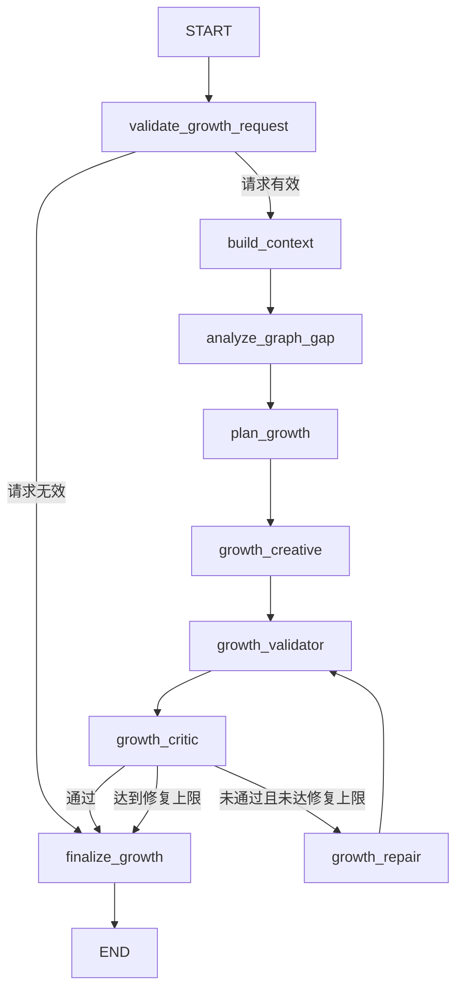

# 生长节点流程与技术说明

> 面向前端、后端、数据库和 Agent 开发队友。本文描述当前 Python LangGraph 生长模块的真实实现、数据边界及后续接入方式。

## 1. 模块目标

首轮工作流会生成创意元素、动机与冲突、剧情事件三类各两个候选。生长模块在首轮结果之上，接收用户选中的已采用节点、生长方向、目标类型和可选补充要求，生成三个新的图谱候选。

生长模块解决四个核心问题：

1. 首轮六个候选不能被后续生成覆盖；
2. 新候选不能与首轮候选、正式图谱或历史拒绝方向冲突；
3. 后续生成必须持续记住推广对象、主体、卖点和故事设定；
4. 用户采用新候选后，它必须能成为下一轮生长的合法种子。

当前实现属于 B 侧 Agent 领域工作流。它不直接操作数据库，也不保存前端画布坐标。

## 2. 输入与输出

### 2.1 前端输入

| 前端字段 | 后端字段 | 是否必填 | 说明 |
|---|---|---|---|
| 选择的节点 | `growth.request.seed_node_id` | 是 | 只能选择 `adopted` 节点 |
| 生长方向 | `growth.request.direction` | 是 | 六个固定枚举之一 |
| 生成类型 | `growth.request.requested_category` | 否 | 为空时由方向和种子类型决定 |
| 补充要求 | `growth.request.additional_requirements` | 否 | 不能覆盖 Brief 硬约束 |
| 图谱版本 | `growth.request.base_graph_version` | 是 | 防止基于过期图谱生成或采用 |
| 候选数量 | `growth.request.candidate_count` | 是 | 默认 3，允许 1～5 |

示例请求：

```json
{
  "growth_run_id": "growth-run-018",
  "seed_node_id": "node-event-103",
  "seed_node_version": 7,
  "direction": "generate_followup_event",
  "requested_category": "story_event",
  "additional_requirements": "保持轻松荒诞，不增加新主角",
  "candidate_count": 3,
  "base_graph_version": 7,
  "first_round_run_id": "first-round-001"
}
```

### 2.2 输出

生长结果位于：

```python
state["growth"]["result"]
```

主要字段：

```text
status                 生成质量状态
selection_status       用户采用状态
growth_run_id          当前生长批次
seed_node_id           生长起点
direction              用户选择的方向
resolved_category      后端最终采用的分类
candidates             本轮新候选
validation             硬规则校验结果
critique               Critic 语义评价
iteration_count        自动修复次数
base_graph_version     生成时使用的图版本
```

`status` 可能为：

- `ready_for_selection`：可以交给前端选择；
- `needs_review`：达到修复上限仍有问题；
- `failed`：请求或流程级错误。

`selection_status` 独立表示用户决策：

- `pending`：等待用户选择；
- `adopted`：已采用一个候选；
- `rejected`：用户拒绝本轮结果。

生成质量通过不等于用户已经采用。

## 3. 首轮数据与生长数据的隔离

```text
state.final_result.candidates
  首轮六个候选，只读

state.first_round_selection
  首轮候选的 pending / adopted / rejected / superseded 决策

state.graph_snapshot
  只包含已采用节点和关系的正式图谱快照

state.growth
  当前生长 run 的请求、上下文、计划、候选、校验、批评和结果
```

生长候选只能写入：

```python
state["growth"]["draft"]["new_candidates"]
```

生长节点不能修改：

```python
state["draft"]["candidates"]
state["final_result"]["candidates"]
```

每个生长候选使用独立命名空间：

```text
growth:{growth_run_id}:{local_key}
```

示例：

```text
growth:growth-run-018:gr_1
```

因此它不会和首轮 `element_1`、`conflict_1`、`event_1` 或数据库节点 ID 混淆。

## 4. SharedState 结构

统一 `SharedState` 在首轮字段之外增加：

```python
class SharedState(TypedDict):
    # 首轮生成字段
    brief: NormalizedBrief
    analyses: CreativeAnalyses
    draft: CreativeDraft
    final_result: FirstRoundResult

    # 首轮用户选择和正式图谱快照
    first_round_selection: FirstRoundSelection
    graph_snapshot: GraphSnapshot

    # 当前生长 run
    growth: GrowthState
    workflow_phase: Literal["initial_generation", "growth"]

    # 通用运行字段
    current_stage: str
    messages: list[AgentMessage]
    errors: list[str]
    metadata: dict[str, Any]
```

`GrowthState` 包含：

```python
class GrowthState(TypedDict):
    request: GrowthRequest
    context: GrowthContext
    gap_analysis: GraphGapAnalysis
    plan: GrowthPlan
    draft: GrowthDraft
    validation: GrowthValidation
    critique: GrowthCritique
    repair_plan: GrowthRepairPlan
    result: GrowthResult
    repair_iteration: int
    max_repair_iterations: int
```

所有字段都由 `empty_growth_state()` 初始化，不能等待某个节点临时创建。

### 4.1 不可变更新

生长节点继续遵守完整 State 和不可变更新原则：

```python
new_growth = rebuild_growth(
    state["growth"],
    plan=new_plan,
)

return rebuild_state(
    state,
    growth=new_growth,
    current_stage="growth_planned",
)
```

`rebuild_growth()` 深拷贝嵌套生长字段，`rebuild_state()` 再重建完整顶层 State。节点不能在旧列表或字典上 `append`、`update`，也不能只返回局部补丁。

`@immutable_full_state_node` 会在运行时检查：

- 输入 State 没有被修改；
- 输出包含全部 `SharedState` 字段；
- 顶层可变容器没有被直接复用。

## 5. LangGraph 工作流



每个节点的职责：

| 节点 | 是否调用模型 | 读取重点 | 写入重点 |
|---|---:|---|---|
| `validate_growth_request` | 否 | 请求、种子、图版本 | 请求错误、初步 Validation |
| `build_context` | 否 | 正式图谱、首轮候选、Brief | `growth.context` |
| `analyze_graph_gap` | 否 | 节点分类、冲突、卖点引用 | `growth.gap_analysis` |
| `plan_growth` | 否 | 方向、种子类型、缺口 | `growth.plan` |
| `growth_creative` | 是 | Context、Plan、方向 Prompt | 三个新候选 |
| `growth_validator` | 否 | 新候选和所有合法引用 | 确定性冲突列表 |
| `growth_critic` | 是 | 候选、校验、正式设定 | 评分、Issue、Repair Plan |
| `growth_repair` | 是 | 旧草稿和 Repair Plan | 完整的新草稿 |
| `finalize_growth` | 否 | 当前草稿、校验和 Critic | `growth.result` |

当前 `plan_growth` 会记录 `required_specialist`，但尚未动态调用首轮专项 Analyst；后续可以根据该字段增加条件边。

## 6. 生长上下文构建

`build_context` 不把全部历史聊天直接塞进模型，而是构造结构化 `GrowthContext`：

```text
seed_node
adopted_nodes / adopted_edges
neighbor_nodes / ancestor_nodes
initial_candidate_summaries
rejected_signatures
promotion_subject
canonical_protagonist
continuity_rules
must_keep / must_avoid
current_blueprint
open_conflicts
event_timeline
```

上下文中的数据分为两种：

- `adopted_nodes`：正式事实，与它们矛盾属于错误；
- `initial_candidate_summaries`：首轮全部候选，只用于查重，不全部视为正式剧情。

被拒绝候选会压缩为 `rejected_signatures`，用于阻止系统换一种说法重复生成用户不喜欢的方向。

## 7. 六个生长方向

| 方向枚举 | UI 文案 | 默认/强制分类 | 推荐关系 | 生成重点 |
|---|---|---|---|---|
| `deepen_current` | 深化当前节点 | 默认与种子相同 | `elaborates`、`details` | 增加机制和细节，不改核心含义 |
| `generate_followup_event` | 生成后续事件 | 强制 `story_event` | `causes`、`leads_to` | 建立因果链并推动主体行动 |
| `add_obstacle` | 增加阻碍 | 强制 `motivation_conflict` | `obstructs`、`escalates` | 增加阻力、代价和升级方式 |
| `add_character_or_prop` | 补充人物或道具 | 强制 `creative_element` | `used_by`、`enables` | 增加有剧情功能的新元素 |
| `generate_reversal` | 生成反转 | 默认 `story_event` | `reveals`、`reverses` | 重新解释已有事实，不否定正式事实 |
| `create_parallel_plan` | 创建平行方案 | 默认与种子相同 | `branches_from`、`alternative_to` | 保留起点和目标，改变实现机制 |

方向与分类不兼容时，在调用模型前失败。例如：

```text
direction = generate_followup_event
requested_category = creative_element
```

系统不会偷偷改成其他类型，也不会浪费一次模型调用。

## 8. Prompt 组合

Prompt 由三部分组合：

```python
system_prompt = (
    GROWTH_SYSTEM_PROMPT
    + direction_prompt
    + GROWTH_OUTPUT_CONTRACT
)
```

### 8.1 公共 Prompt

`GROWTH_SYSTEM_PROMPT` 统一声明：

- 硬约束和正式图谱事实优先；
- 补充要求不能覆盖硬约束；
- 未采用候选只能用于查重；
- 不允许替换推广对象或无故更换主角；
- 只能生成新候选，不能修改旧节点；
- 每个候选必须连接种子节点；
- 不生成数据库 ID、采用状态、坐标和版本。

### 8.2 方向 Prompt

六个方向分别约束生成目标、强制分类、推荐关系和禁止行为。例如“深化当前节点”禁止借深化之名改写节点；“生成反转”禁止无铺垫身份替换和“一切都是梦”。

### 8.3 输出协议

模型只返回：

```json
{
  "resolved_category": "story_event",
  "candidates": []
}
```

模型只负责 `local_key`，后端负责构造：

```text
candidate_id = growth:{growth_run_id}:{local_key}
```

## 9. 生长候选结构

每个 `GrowthCandidate` 包含：

```text
candidate_id / local_key / growth_run_id
seed_node_id / seed_node_refs
direction / category / subtype
title / description
actor_refs / product_feature_refs
proposed_relations
rationale / story_effect / risk_flags
lineage
blueprint_patch
```

`lineage` 记录根节点、父节点、run 和生成方向，使后续节点可以追溯来源。

`blueprint_patch` 只表示“如果用户采用该候选，建议修改哪些 Story Blueprint 字段”，生成阶段不会立即修改正式故事设定。

## 10. 冲突检测

State 隔离只能防止数据覆盖，不能单独解决内容冲突，因此系统增加确定性 Validator 和语义 Critic 两层检查。

### 10.1 Validator

确定性检查包括：

- `local_key` 格式合法、本轮唯一且不与历史标识冲突；
- `candidate_id` 属于当前 `growth_run_id` 命名空间；
- 候选数量等于 `candidate_count`；
- 分类等于 `GrowthPlan.resolved_category`；
- 标题不超过 18 个字符；
- 描述和 `story_effect` 完整；
- 不与首轮六个候选标题或描述完全重复；
- 不重复用户明确拒绝的创意签名；
- 冲突和事件必须存在 `actor_refs`；
- 人物、卖点和关系引用必须真实存在；
- 每个候选至少有一条关系直接连接种子节点；
- 不生成自环；
- 不违反 `must_avoid`。

Validator 输出结构化 `GrowthConflict`：

```text
conflict_type
severity
candidate_key
conflicting_ref
message
repair_instruction
```

当前确定性重复检测覆盖标识、标准化标题、标准化描述和拒绝签名；更复杂的语义近似由 Critic 负责，未来可以增加 embedding 相似度。

### 10.2 Critic

Critic 评价八个维度：

- `anchor_alignment`：是否仍围绕推广主体；
- `continuity`：是否与正式图谱连续；
- `graph_gain`：是否增加新的图谱信息；
- `story_progress`：是否推动主体和剧情；
- `product_integration`：产品是否自然参与因果；
- `novelty`：是否具有新意；
- `relation_quality`：拟议关系是否合理；
- `duplicate_risk`：与历史内容的重复风险。

即使模型返回 `passed=true`，只要 Validator 仍有 `error`，后端也会强制判定为不通过。

## 11. Repair Loop

Critic 不直接修改候选，只返回：

```python
class GrowthRepairPlan(TypedDict):
    preserve_candidate_keys: list[str]
    rewrite_candidate_keys: list[str]
    instructions: list[str]
```

`growth_repair` 必须返回完整候选列表，但只能重写 `rewrite_candidate_keys`，其余候选应保持不变。修复后再次经过 Validator 和 Critic。

默认最多自动修复一次。达到上限仍未通过时返回 `needs_review`，避免高频交互中无限调用模型。

## 12. 采用与继续生长

生成 Workflow 只返回候选，不自动写入正式图谱。用户采用时调用 `adopt_growth_candidate()`：

1. 检查结果为 `ready_for_selection`；
2. 检查 `selection_status` 仍为 `pending`；
3. 检查 `expected_graph_version`；
4. 把临时 `local_key` 映射为正式节点 ID；
5. 转换候选引用和拟议关系；
6. 把新节点和关系加入新的 `graph_snapshot`；
7. 将图版本加一；
8. 把新节点作为下一轮 `create_growth_run_state()` 的合法种子。

```text
生成候选
  -> 用户采用
  -> graph_version 7 变为 8
  -> 新节点进入 adopted 图谱
  -> 用户从新节点继续生长
```

`expected_graph_version` 不一致时拒绝采用，避免两个用户或两个页面同时基于旧图写入。

当前 `adopt_growth_candidate()` 是本地领域 helper。生产系统应在数据库事务中完成 ID 分配、关系写入和版本更新，然后从数据库重新构建 `GraphSnapshot`。

如果用户对这一批 3 个候选都不满意，调用 `reject_growth_candidates()`。它会将同批候选全部标记为 `rejected`，但不改变 `GraphSnapshot` 和图版本。这使后续 Story 生成不会被永久卡在 `pending`。

用户完成所有候选决策后的 Story 收敛见 [`Story收敛流程与技术说明.md`](./Story收敛流程与技术说明.md)。

## 13. 前端交互建议

推荐交互流程：

```text
点击 adopted 节点
  -> 选择六个方向之一
  -> 前端自动限制生成类型
  -> 填写可选补充要求
  -> 提交 growth request
  -> 展示阶段进度
  -> 以半透明幽灵节点展示三个候选
  -> 用户比较关系、Story Effect、风险和 Critic 评分
  -> 采用一个候选
  -> 幽灵节点转为正式节点
```

前端视觉状态建议：

| 状态 | 视觉表现 |
|---|---|
| adopted | 实线边框，可继续生长 |
| growth candidate | 半透明背景、虚线边框 |
| selected candidate | 双层高亮圆环 |
| needs review | 橙色警告标记 |
| rejected | 灰色或隐藏 |

前端 UI State 不进入 LangGraph State。画布缩放、悬停、面板开关、当前标签页等继续由 React/React Flow 管理。

## 14. API 接入建议

生产环境建议提供：

```text
POST /api/projects/{project_id}/growth-runs
GET  /api/growth-runs/{run_id}/events
POST /api/growth-runs/{run_id}/adopt
POST /api/growth-runs/{run_id}/reject
```

生成可能包含多次模型调用，建议用 SSE 返回阶段：

```text
growth_context_built
growth_gap_analyzed
growth_planned
growth_candidates_generated
growth_validated
growth_critic_passed / growth_critic_rejected
growth_completed
```

Python State 中不保存数据库客户端、模型客户端、用户密钥或前端 UI 状态。模型通过依赖注入传入，数据库和请求生命周期由 TypeScript 应用层负责。

## 15. 本地运行

Mock 模式：

```powershell
cd python_agents
$env:CREATIVE_MODEL_PROVIDER = "mock"
python examples\growth_demo.py
```

指定方向：

```powershell
python examples\growth_demo.py `
  --direction add_obstacle `
  --category motivation_conflict `
  --requirements "阻碍来自游戏规则，不增加新反派"
```

DeepSeek 使用 OpenAI-compatible 配置：

```powershell
$env:CREATIVE_MODEL_PROVIDER = "deepseek"
$env:OPENAI_API_KEY = "你的密钥"
$env:OPENAI_BASE_URL = "https://api.deepseek.com"
$env:OPENAI_MODEL = "deepseek-chat"
python examples\growth_demo.py
```

运行测试：

```powershell
python -m unittest discover -s tests -v
```

当前测试覆盖：

- 首轮六个候选在生长过程中保持不变；
- 六个方向的目标分类；
- 方向与分类不兼容时不调用模型；
- 生长 ID 命名空间；
- 首轮重复候选检测；
- Critic 局部修复；
- 每个流式 State 快照字段完整；
- 未采用候选不能作为种子；
- 过期图版本不能采用；
- 采用后能够从新节点继续第二轮生长。

## 16. 代码入口

| 文件 | 作用 |
|---|---|
| `src/creative_graph_agents/state.py` | Growth TypedDict、不可变重建、采用和图版本 |
| `src/creative_graph_agents/prompts.py` | 公共 Prompt、六方向 Prompt、输出协议和 Critic Prompt |
| `src/creative_graph_agents/growth_nodes.py` | 生长业务节点、冲突 Validator、Critic 和路由 |
| `src/creative_graph_agents/growth_workflow.py` | LangGraph StateGraph 和条件边 |
| `src/creative_graph_agents/model.py` | DeepSeek/OpenAI-compatible 与 Mock 响应 |
| `examples/growth_demo.py` | 首轮生成、采用种子和一次生长演示 |
| `tests/test_growth_workflow.py` | 生长流程和回归测试 |

## 17. 当前边界与后续工作

已经完成：

- 统一不可变 State；
- 首轮和生长数据隔离；
- 六方向 Prompt；
- 三候选生成；
- 确定性冲突检查；
- Critic 与 Repair Loop；
- 本地采用和连续生长；
- Mock 与 DeepSeek/OpenAI-compatible 模型适配；
- 自动化测试和 Demo。

尚未完成：

- TypeScript `CreativeAgentGateway.growNode()` 到 Python Workflow 的真实调用；
- HTTP/SSE 接口；
- 正式数据库事务和节点 ID；
- 前端生长面板与幽灵节点绑定；
- embedding 级语义重复检测；
- 根据 `required_specialist` 动态调用专项 Analyst；
- 生产级 token、耗时、重试和 trace 统计。

## 18. 一句话总结

生长模块把“用户选择节点和方向 → 构建正式图谱上下文 → 生成新候选 → 检查与首轮及正式设定的冲突 → Critic 评价与局部修复 → 用户采用 → 图版本更新 → 继续下一轮生长”组织成一条完整、可追踪且不覆盖首轮六个候选的 LangGraph 工作流。
